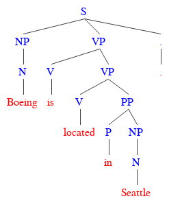
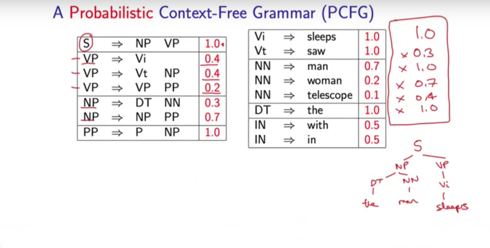
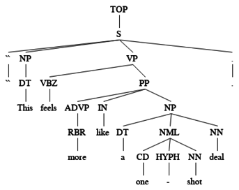
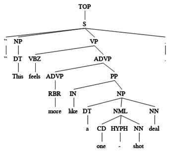

# Training the Berkeley Parser on the WSJ Penn treebank for the English language

## What is Parsing?

* **INPUT:**

<span style="margin: 0 5em">Boeing is located in Seattle.</pre>

* **OUTPUT**

</img>

In the parsing problem we're given a sentence in input and we produce an object called a parse tree.

A **parse tree** is a tree structure with the words in the sentences as leaves of the tree, e.g. *Boeing*, *is*, *located*, *in*, *Seattle*. and other labels, such as *NP*, *PP*, *VP*, *S*, etc., in the inner nodes.

Thus, at very high level we have a hierarchical decomposition of the sentence into the tree structure.


## Unzip the tar.gz archive
```
 $ tar -zxvf berkeley.tar.gz
```
 
## Probabilistic Context Free Grammar (PCFG)
Training a parser consists in learning a PCFG generating all the parse trees in a treebank.

A context-free grammar (CFG) is a 4-tuple G = (N, &Sigma;, R, S) where:
<ul>
<li> N is a finite set of non-terminal symbols. </li>
<li> &Sigma; is a finite set of terminal symbols. </li>
<li> R is a finite set of rules of the form X &rarr; Y<sub>1</sub>Y<sub>2</sub> . . . Y<sub>n</sub>, where X &isin; N, n &ge; 0, <br/>
 and Y<sub>i</sub> &isin; (N &cup; &Sigma;) for i = 1 . . . n. </li>
<li> S &isin; N is a distinguished start symbol </li>
</ul>

A Probabilistic context-free grammar (PCFG) is defined as follows:
 
**Definition** A PCFG is a 5-tuple G = (N, &Sigma;, R, S, P), where:
 
1. N, &Sigma;, R, S are the same as in a CFG

2. P is the set of probabilities on production rules

</img>
   
You can generate a parse tree by repeatedly sampling a rule from a PCFG until you have only terminals.

## Train the Berkeley Parser

We would like to learn a grammar that generate all possible sentences for the English language.

In order to learn a grammar we need a treebank. A treebank is a corpus of sentences annotated with their corresponding parsed trees. 

The treebank for the English language is the WSJ Penn Treebank.

The file `wsj_02-21.parse` in the data dir contains all the data from section 02 to section 21 of the Penn Treebank corpus. 

To train a parser model for English, type the following command:

```
 $ java -cp libs/BerkeleyParser-1.7.jar edu.berkeley.nlp.PCFGLA.GrammarTrainer -v -SMcycles 1 -path data/wsj_02-21.parse -out wsj_grammar.gr -treebank SINGLEFILE
```

## View a grammar file
The Berkeley parser reads and writes grammar files as serialized java classes. To view the grammars, you can export them to text format with:

```
 $ java -cp libs/BerkeleyParser-1.7.jar edu/berkeley/nlp/PCFGLA/WriteGrammarToTextFile wsj_grammar.gr wsj_grammar
```

The exported grammar contains the following files:

* **wsj_grammar.lexicon**: Probabilities of rules generating terminal symbol
* **wsj_grammar.grammar**: Probabilities of rules generating nonterminal symbols
* **wsj_grammar.words**: list of words appearing in the treebank

## Parse with the Berkeley Parser

Parse 23th fold

```
 $ java -cp libs/BerkeleyParser-1.7.jar edu.berkeley.nlp.PCFGLA.BerkeleyParser -gr wsj_grammar.gr -inputFile data/wsj_23.pos -useGoldPOS > wsj_23.out
```

Parse 24th fold

```
 $ java -cp libs/BerkeleyParser-1.7.jar edu.berkeley.nlp.PCFGLA.BerkeleyParser -gr wsj_grammar.gr -inputFile data/wsj_24.pos -useGoldPOS > wsj_24.out
```

## Evaluate the trained model

Parsers are evaluated according to Precision, Recall anf FMeasure of generated parse trees:

 - Precision = number of correct constituents in parser output /  number of constituents in the parser output

 - Recall =  number of correct constituents in parser outut / number of constituents in the gold standard

 - F1-Measure = 2 * P * R / (P + R)

Type the following command to evaluate the performance of the parsers on the sentences in the 23th fold:

```
 $ ./EVALB/evalb -p EVALB/COLLINS.prm data/wsj_23.gold wsj_23.out
```

Precision | Recall | FMeasure 
--------- | ------ | --------
  72.83%  | 74.61% |  73.71%

Type the following command to evaluate the performance of the parsers on the sentences in the 24th fold:

```
 $ ./EVALB/evalb -p EVALB/COLLINS.prm data/wsj_24.gold wsj_24.out
```

Precision | Recall | FMeasure 
--------- | ------ | --------
  72.01%  | 73.55% |  72.77%


So, for example, let assume your have the following gold tree (left) and the parse tree (right) for the sentence: ``This feels more like a one - shot deal.``

<pre>
 <table>
  <tr>  
   <th style="font-size: 110%; font-family: Arial, Helvetica, sans-serif">1. Gold tree</th>
   <th style="font-size: 110%; font-family: Arial, Helvetica, sans-serif"">2. Parsed tree</th>  
  </tr>
  <tr>
   <td></td>
   <td></td>
  </tr>
  <tr>
   <td>TOP -> S</td>
   <td style="color: red"><u>TOP -> S</u></td> 
  </tr>
 <tr>
   <td>S -> `` NP VP .</td>
   <td>S -> `` NP VP .</td> 
  </tr>
  <tr>
   <td>NP -> DT </td>
   <td style="color: red">NP -> DT </td>
  </tr>
  <tr>
   <td>VP -> VBZ PP</td> 
   <td style="color: red">VP -> VBZ ADVP</td>
   </td>
  </tr>
  <tr>
   <td>PP -> ADVP IN NP</td>
   <td sytle="color: red">ADVP -> ADV PP</td>
  </tr>
  <tr>
   <td>ADVP -> RBR</td>
   <td style="color: red">ADVP -> RBR</td>
  </tr>
  <tr>
   <td>NP -> DT NML NN</td>
   <td>PP -> IN NP</td>
  </tr>
  <tr>
   <td>NML -> CD HYPH NN</td>
   <td style="color: red">NP -> DT NML NN</td>
  </tr>
  <tr>
   <td></td>
   <td style="color: red">NML -> CD HYPH NN</td>
  </tr>
 </table>
</pre>

Thus:

 <ul>
  <li> <span style="font-weight:bold"> Precision </span> = <span style="color:red">7</span> / 9 = 0.777 </li>
  <li> <span style="font-weight:bold"> Recall </span> = <span style="color:red">7 </span> / 8 = 0.875 </li>
  <li> <span style="font-weight:bold"> F1-Measure </span> = 2 * 0.777 * 0.875 / (0.777 + 0.875) = 0.823...</li>
 </ul>

## Parse a sentence input from STDIN
By default, the BerkeleyParser will read a sentence from STDIN (one per line) and write parse trees to STDOUT.

To read a sentence from STDIN, type the following command:

```
    $ java -cp libs/BerkeleyParser-1.7.jar edu.berkeley.nlp.PCFGLA.BerkeleyParser -gr wsj_grammar.gr
```

Then, input the following sentence:

```
 The dog laughs .
```

Your output should looks like this:

```
( (S (NP (DT The) (NN dog)) (VP (VB laugh)) (. .)) )
```


In order to print a sentence into a file, you have to pass the *-outputFile* option

```
 $ java -cp libs/BerkeleyParser-1.7.jar edu.berkeley.nlp.PCFGLA.BerkeleyParser -gr wsj_grammar.gr -outputFile parse.out
```

Then, type `CTLR^D` to stop the parser execution.


 

## See the viterbi derivation of a tree.
A tool for annotating parse trees with their most likely Viterbi derivation over refined categories and scoring the subtrees can be started with:

```
$ java -cp libs/BerkeleyParser-1.7.jar edu.berkeley.nlp.PCFGLA/TreeLabeler -gr wsj_grammar.gr
```

Then, type:

```	
(TOP (S (NP (DT The) (NN dog)) (VP (VB laugh)) (. .)) )
```

The output should look something like this:

```
( (S-0 (@S-1 (NP-2 (DT-2 The) (NN-1 dog)) (VP-1 (VB-1 laugh))) (.-1 .)))
```

## Compute the log-likelihood of a parse tree.
This tool reads in parse trees and compute (log-)likelihood of a parse tree, i.e. **T(t|s)**. 

To do so, type the following command:

```
$ java -cp libs/BerkeleyParser-1.7.jar edu.berkeley.nlp.PCFGLA.TreeScorer -gr wsj_grammar.gr
```

Then, input the following tree:

```
$ (TOP (S (NP (DT The) (NN dog)) (VP (VB laugh)) (. .)) )
```

You should get the following (log-)likelihood value:
```
-31.23685977325989
```

## How parsing works? 

Let assume we've a grammar with the following production rules.

Precision | Recall 
--------- | ------ 
  S -> S. | 1.0 
  

S -> S . |  1.0
--------------------
S -> NP VP | 0.9
S -> NP    | 0.1
--------------------
VP -> VBZ   | 0.4
VP -> VB NP | 0.4
VP -> VP PP | 0.2
--------------------
NP -> DT NN  | 0.6
NP -> DT NNS | 0.4
--------------------
DT -> The | 1.0
--------------------
NN -> dog | 1.0
--------------------
laughs -> VBZ | 0.6
laughs -> NNS | 0.4
--------------------


## Exercise 1. 
Train for more iterations by incresing the value of the *-SMcycles* parameter.
Then, parse file ```wsj_23.pos``` and ```wsj_24.pos``` again. What happens?


