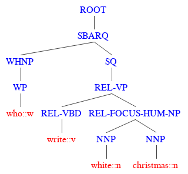

**RelTextRank** is flexible Java pipeline for converting pairs of raw texts into structured representations and enriching them with semantic information about the relations between the two pieces of text (e.g., lexical exact match). 


# Installation

## Prerequisites
The tool requires the following prerequisites:
*	Java 1.8+
*	Apache Maven > 3.3.9. Refer to http://maven.apache.org/install.html for the installation instructions
* Python 2.7.x (required by the evaluation script)

## Installing
If this is the first time that you are using the global ANLPIR-2018 course repository, clone it as follows:
```bash
git clone https://github.com/iKernels/ANLPIR-2018.git
```

Otherwise, simply pull:
```bash 
git pull
```

Run the following command sequence to install the software and set the Java classpath.

```bash
cd ./partIV/qapipeline/RelationalTextRanking

cd ./RelationalTextRanking

export JAVA_HOME=<path to your JDK distribution>

sh scripts/install/install.sh 

rm target/dependency/google-collections-1.0.jar 

export CLASSPATH=${CLASSPATH}:bin/:target/dependency/*:target/classes

mkdir logs
```

# Running the experiments

## Downloading the WikiQA dataset
In this lab we will run experiments on the WikiQA dataset.
First you need to download the WikiQA data from https://www.microsoft.com/en-us/download/details.aspx?id=52419. 
Then run the following commands from the root of the RelTextRank distribution.

```bash
export wikiqa_location=<folder to which you unpacked the WikiQa distribution>
mkdir data/wikiQA
python scripts/converters/wikiqa_convert.py ${wikiqa_location}/WikiQA-train.tsv data/wikiQA/WikiQA-train.questions.txt  data/wikiQA/WikiQA-train.tsv.resultset
python scripts/converters/wikiqa_convert.py ${wikiqa_location}/WikiQA-test.tsv data/wikiQA/WikiQA-test.questions.txt  data/wikiQA/WikiQA-test.tsv.resultset
python scripts/converters/wikiqa_convert.py ${wikiqa_location}/WikiQA-dev.tsv data/wikiQA/WikiQA-dev.questions.txt  data/wikiQA/WikiQA-dev.tsv.resultset
```

It may take a long time to train the pipeline on the full-scale data on  your personal machine. Therefore, try training on a subset of the training set.
Run the following command to prepare the input file with the toy input data:
```bash
python scripts/converters/extract_trainset_subset.py -i data/wikiQA/WikiQA-train.questions.txt -o  data/wikiQA/WikiQA-train.questions.toy.txt -p 0.3
```

## Running experiments with a conveniency script
We provide a conveniency python script which generates a shell script which runs the end-to-end experiment in a specific configuration:

```bash 
python scripts/experiment_launchers/experiment_launcher.py  
```

Its options are:
* ```-l```: corpus name; The script will look for a file named ```scripts/experiment_launchers/corpus_settings/<corpusname>.setting``` which contains relative paths to the corpus train and test files;
* ```-o```: in which folder to store the end-to-end experimental shell script;
* ```-c```: experiment label (can be any, is used to generate name for the folder with the experimental data;
* ```-p```: SVMLight-TK parameters (run ```tools/SVM-Light-1.5-rer/svm_learn``` to see the possible options); 
* ```-e```: name of the class with which you want to generate the structural representations (see below for the possible options);
* ```-suf```: by default the model will be stored in the ```svm_${suf}.model``` file;
* ```-s```: specifies in for which setting you want to generate the input data, reranking or classification (see below for the possible options); 
* ```-ate " -skipAllSame" -ade" -skipAllSame"```: add this if you want skip the questions which have only positive or only negative answers in the corpus.

```experiment_launcher.py``` generates a shell script

```nohup sh scripts/generated_scripts/<corpus_name>_<experiment_label>_<date>_<suffix>.sh > logs/<corpus_name>_<experiment_label>_<date>_<suffix>.log 2>&1  &```

which:
* launches three parallel java processes which convert the input train, test, dev data into to structural representations (type of rep. selected by the ```-c``` parameter) and save them as training/test data in the SVMLight-TK format. It generates the following files and folders:
 * ```data/examples/<corpus_name>_<experiment_label>_<current_date>```
    * ```svm.train```: TRAIN data in SVMLight-TK format
    * ```svm.test```: DEVELOPMENT data in SVMLight-TK format
    * ```svm.relevancy```: question and answer ids for ```svm.test```. Line-by-line aligned with ```svm.test```.
 * ```data/examples/<corpus_name>_TEST_<experiment_label>_<current_date>``` 
    * ```svm.test```: TEST data in SVMLight-TK format
    * ```svm.relevancy```: question and answer ids for ```svm.test```. Line-by-line aligned with ```svm.test```.
* trains and SVMLight-TK model on ```data/examples/<corpus_name>_<experiment_label>_<current_date>/svm.train``` and stores it in the ```data/examples/<corpus_name>_<experiment_label>_<current_date>/svm_<suf>.model``` file
* classifies DEV and TEST data and outputs predictions into:
    * DEV: ```data/examples/<corpus_name>_<experiment_label>_<current_date>/svm_<suf>.pred``` 
    * TEST: ```data/examples/<corpus_name>_TEST_<experiment_label>_<current_date>/svm_<suf>.pred``` 
* evaluates the performance. You may see it here:
    * ```tail -11 logs/<corpus_name>_<experiment_label>_<date>_<suffix>.log```

This is an example of the script generated by the experiment_launcher: [wikiqa_toy_CH_23-05-2018_T.sh](https://github.com/iKernels/ANLPIR-2018/blob/master/partIV/qapipeline/RelationalTextRanking/scripts/generated_scripts/wikiqa_toy_CH_23-05-2018_T.sh).


### Structure and settings options
#### Structure generation classes (-c option)
All structure generators are available as classes in the ```it.unitn.nlpir.experiment.fqa``` package.
See the descriptions of the structures in the tables below. Images are reduced in size to fit into the table. Open them in a new browser tab to see the full-size version. All these classes convert input pairs of texts ```(T1,T2)``` into relational structural representations.

|Abbreviation | Class | Example |Description|
|---|---|---|---|
|CH | ```CHExperiment```  ||Here, T1 and T2 are both represented as shallow tree structures with lemmas as leaves, their POS-tags as their parent nodes. The POS- tag nodes are further grouped under chunk and sentence nodes. CH excludes punctuation marks and words not included into any chunk.|
|DT1 | ```DT1Experiment```  ||A dependency tree in which grammatical relations become nodes and lemmas are located at the leaf level|
|DT2 | ```DT2Experiment```  ||DT1 modified to include the chunking information, and lemmas in the same chunk are grouped under the same chunk node.|
|LCT<sub>Q</sub>-DT2<sub>A</sub>  | ```LCTqDT2aExperiment```  || T2 is represented as DT2. T1 is represented as a lexical-centered dependency tree with the grammatical relation ```REL(head,child)``` represented as ```(head (child HEAD GR-REL POS-pos(head))```. Here ```REL``` is a grammatical relation, ```head``` and ```child``` are the head and child lemmas in the relation, respectively, and ```pos(head)``` is the POS-tag of the head lemma. ```GR-``` and ```POS-``` tag in the node name indicates that the node is grammar relation or part-of-speech node, respectively. |
|CONST |```ConstExperiment``` ||Constituency tree|

#### Input data generation settings (-s option)
* **ClassTextPairConversion.** Generates the SVMLightTK train/test file to be used with the classification kernel
   * Classification kernel is ```Kclass(P1,P2)=K(Q1,Q2)+ K(A1,A2)```. The respective system classifies input ```P=(Q,A)``` question-answer pairs.
* **RERTextPairConversion.** Generates the SVMLightTK train/test file to be used with the reranking kernel
   * Reranking kernels is applied to pairs of Q/A pairs ```Krer<(P1,P2), (P1',P2')>```. The respective system is trained on input pairs of Q/A pairs ```(P1,P2)```, which is positive if ```P1``` should be ranked  higher (i.e. more correct) than ```P2```, and negative otherwise. 


### Running experiments on WikiQA
To train on full-scale data (will take time):
```bash
export corpus_name=wikiqa
```
OR 

To train on toy data (hopefully, fast):
```bash
export corpus_name=wikiqa_toy
```

You may run experiments with the following structures as written below. The experiment launcher script generates a script file with the commands inside.

The below commands will output something like the following:
```nohup sh scripts/generated_scripts/<corpus_name>_<experiment_label>_<date>_<suffix>.sh > logs/<corpus_name>_<experiment_label>_<date>_<suffix>.log 2>&1  &```
Launch this script to run an end-to-end experiment.
In order to see perfomance simply do:
```bash
tail -11 logs/<corpus_name>_<experiment_label>_<date>_<suffix>.log
```
First table reports performance on the development data, and the second on the test data. REF_FILE is the upper bound of performance. SVM is the performance of your system.

You may see the expected performance of the below scrips in [this google spreadsheet](https://docs.google.com/spreadsheets/d/1IyAQmZbNECrQXGlf3r5ExlNY5oWh9OjlOttJbzovlP8/edit#gid=0).

#### Shallow chunk-based structure (CH)
```bash
python scripts/experiment_launchers/experiment_launcher.py  -l ${corpus_name} -o scripts/generated_scripts -c CH -p "-t 5 -F 3 -C T -m 1000"  -e it.unitn.nlpir.experiment.fqa.CHExperiment -suf T -s it.unitn.nlpir.system.core.ClassTextPairConversion -ate " -skipAllSame" -ade " -skipAllSame"
```
#### CONST structure (CONST)
```bash
python scripts/experiment_launchers/experiment_launcher.py  -l ${corpus_name} -o scripts/generated_scripts -c CONST -p "-t 5 -F 3 -C T -m 1000"  -e it.unitn.nlpir.experiment.fqa.ConstExperiment -suf T -s it.unitn.nlpir.system.core.ClassTextPairConversion -ate " -skipAllSame" -ade " -skipAllSame"
```
#### DT1 structure (DT1)
```bash
python scripts/experiment_launchers/experiment_launcher.py  -l ${corpus_name} -o scripts/generated_scripts -c DT1 -p "-t 5 -F 3 -C T -m 1000"  -e it.unitn.nlpir.experiment.fqa.DT1Experiment -suf T -s it.unitn.nlpir.system.core.ClassTextPairConversion  -ate " -skipAllSame" -ade " -skipAllSame"
```

#### DT2 structure (DT2)
```bash
#DT2 structure
python scripts/experiment_launchers/experiment_launcher.py  -l ${corpus_name} -o scripts/generated_scripts -c DT2 -p "-t 5 -F 3 -C T -m 1000"  -e it.unitn.nlpir.experiment.fqa.DT2Experiment -suf T -s it.unitn.nlpir.system.core.ClassTextPairConversion  -ate " -skipAllSame" -ade " -skipAllSame"
```

#### LCT<sub>Q</sub>-DT2<sub>A</sub> structure (DT3q_DT2a)
```bash
python scripts/experiment_launchers/experiment_launcher.py  -l ${corpus_name} -o scripts/generated_scripts -c DT3q_DT2a -p "-t 5 -F 3 -C T -m 1000"  -e it.unitn.nlpir.experiment.fqa.LCTqDT2aExperiment -suf T -s it.unitn.nlpir.system.core.ClassTextPairConversion  -ate " -skipAllSame" -ade " -skipAllSame"
```

#### Running reranking with shallow chunk-based structure (CH)
```bash
python scripts/experiment_launchers/experiment_launcher.py  -l ${corpus_name} -o scripts/generated_scripts -c CH_rer -p "-t 5 -F 3 -C T -W R -V R -m 1000"  -e it.unitn.nlpir.experiment.fqa.CHExperiment -suf T -s it.unitn.nlpir.system.core.RERTextPairConversion -ate " -skipAllSame" -ade " -skipAllSame"
```
In all the above experiments you have been using the Partial Tree Kernel (-F 3). If you want to use the Subset Tree Kernel, for example, you can change this to  ```-F 1```. Traning will be faster, but the results will be lower.

## Using the performance evaluation script
Use the following script to evaluate the peformance:

```bash
python scripts/eval/ev.py --ignore_noanswer --ignore_allanswer data/examples/<experimental_folder>/svm.relevancy data/examples/<experimental_folder>/<predictions_file>
```
Note that svm.relevancy and ```<predictions_file>``` should be aligned line-by-line.

## Visualizing the structural representations demo

If you want to build and visualize structural representations for two input texts, run the following:

```bash
java -Xmx4G it.unitn.nlpir.system.demo.TextPairRepresentationDemo -expClassName it.unitn.nlpir.experiment.fqa.<structure_generation_class_name>
```

For example, if you want to see a CONST structure, you may run:
```bash
java -Xmx4G it.unitn.nlpir.system.demo.TextPairRepresentationDemo -expClassName it.unitn.nlpir.experiment.fqa.ConstExperiment
```
After initialization, the interactive prompt with ask you to enter question and answer delimited by a tab and press ```Enter```.
The demo will then generate the pseudo-code for the structural representations of your input pairs.

For example, if you enter:
```
What is the capital of Italy?   Rome is the capital.
```
the demo will output:
```
[main] INFO it.unitn.nlpir.experiment.fqa.TrecQAWithQCExperiment - [ROOT [ROOT [SBARQ [WHNP [WP [what::w]]] [SQ [VBZ [be::v]] [NP [REL-FOCUS-LOC-NP [DT [the::d]] [REL-NN [capital::n]]] [PP [IN [of::i]] [NP [NNP [italy::n]]]]]] [. [?::.]]]]]       [ROOT [ROOT [S [REL-FOCUS-LOC-NP [NNP [rome::n]]] [VP [VBZ [be::v]] [REL-NP [DT [the::d]] [REL-NN [capital::n]]]] [. [.::.]]]]]
[main] INFO it.unitn.nlpir.system.demo.TextPairRepresentationDemo - Text1: (ROOT (ROOT (SBARQ (WHNP (WP (what::w))) (SQ (VBZ (be::v)) (NP (REL-FOCUS-LOC-NP (DT (the::d)) (REL-NN (capital::n))) (PP (IN (of::i)) (NP (NNP (italy::n)))))) (. (?::.)))))
[main] INFO it.unitn.nlpir.system.demo.TextPairRepresentationDemo - Text2: (ROOT (ROOT (S (REL-FOCUS-LOC-NP (NNP (rome::n))) (VP (VBZ (be::v)) (REL-NP (DT (the::d)) (REL-NN (capital::n)))) (. (.::.)))))
```
Copy-paste the first line, namely
``` 
[ROOT [ROOT [SBARQ [WHNP [WP [what::w]]] [SQ [VBZ [be::v]] [NP [REL-FOCUS-LOC-NP [DT [the::d]] [REL-NN [capital::n]]] [PP [IN [of::i]] [NP [NNP [italy::n]]]]]] [. [?::.]]]]]       [ROOT [ROOT [S [REL-FOCUS-LOC-NP [NNP [rome::n]]] [VP [VBZ [be::v]] [REL-NP [DT [the::d]] [REL-NN [capital::n]]]] [. [.::.]]]]]
```
to http://ironcreek.net/phpsyntaxtree/? and you will see the visualization of your question and answer trees.


